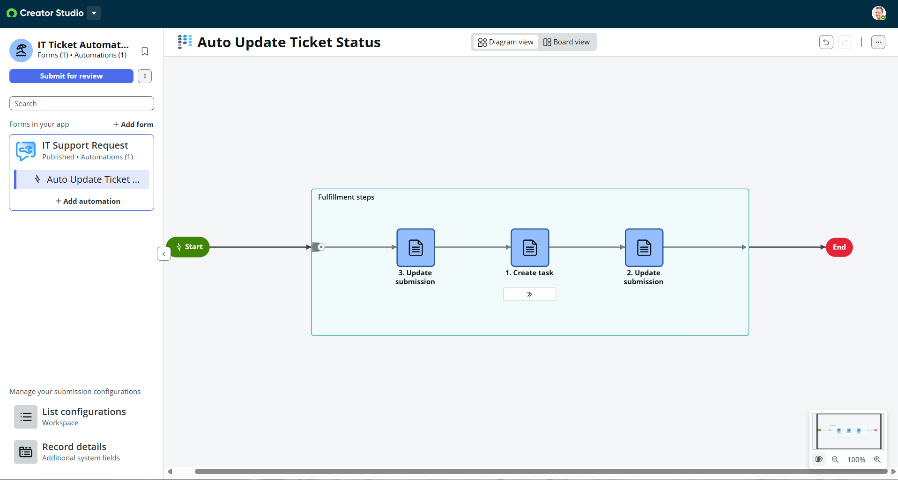
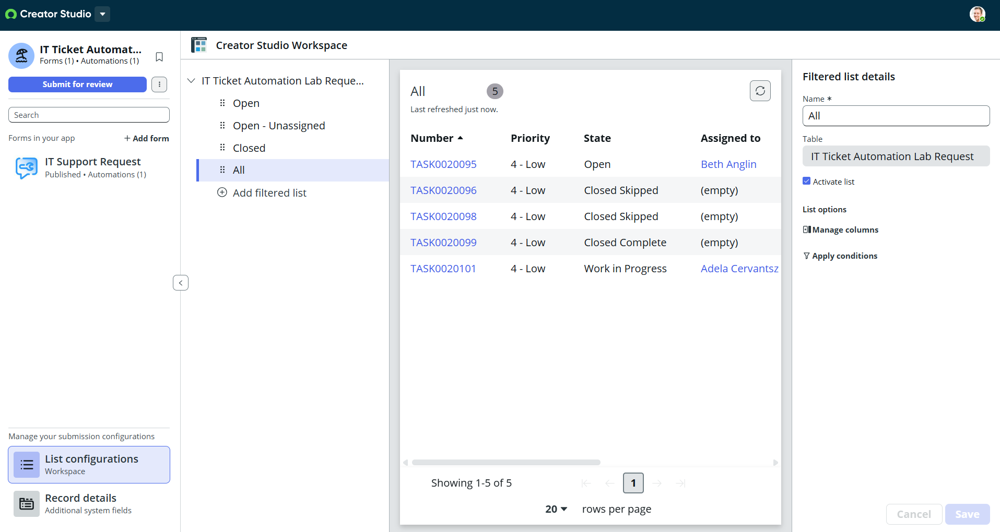

# ServiceNow Ticket Automation Lab

## Overview
This project simulates an IT support request system built using ServiceNow Creator Studio. It demonstrates how tickets can be automatically processed, tasks generated, and statuses updated through workflow automation.

## Features
- Custom IT support request form
- Automated task creation from submitted requests
- Ticket lifecycle management (status updates)
- Workflow automation using ServiceNow Creator Studio

## Workflow
1. User submits IT support request
2. System processes submission
3. Task is automatically created
4. Ticket status updates to "In Progress"

## Screenshots

### Request Form

### Workflow Automation

### Ticket List

## Technologies Used
- ServiceNow Creator Studio
- ITSM Concepts (Incident Management, Workflow Automation)

## What I Learned
- How to design and configure ServiceNow applications
- How to automate workflows using task creation and status updates
- How IT ticket lifecycle management works in enterprise systems
